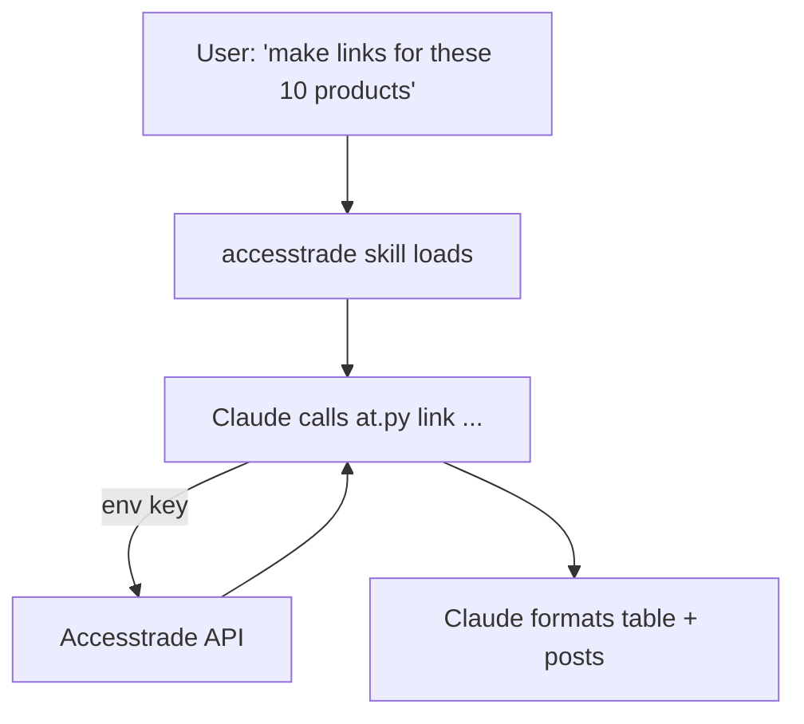

# Designing an Accesstrade skill for Claude Code

**Wrap the Accesstrade API once as a single skill whose `SKILL.md` carries the *playbook* and whose bundled script carries the *HTTP/auth plumbing* — then every affiliate task becomes a natural-language request.** Putting the credential and request logic in a script (not the prompt) keeps the token out of context and makes calls deterministic.

## Layout

```text
~/.claude/skills/accesstrade/
├── SKILL.md          # when-to-use + command recipes
├── reference.md      # full endpoint table (loaded on demand)
└── scripts/
    └── at.py         # reads $ACCESSTRADE_KEY, calls the API, prints JSON
```

## SKILL.md sketch

```yaml
---
name: accesstrade
description: >
  Operate the Accesstrade affiliate API: list/join campaigns, mint tracking
  links, pull conversion/earnings reports, fetch datafeeds and coupons.
  Use when the user mentions Accesstrade, affiliate links, commissions, or campaigns.
allowed-tools: Bash(python3 *)
---

# Accesstrade

Use the bundled client; it injects auth from $ACCESSTRADE_KEY.

- Campaigns:  `python3 ${CLAUDE_SKILL_DIR}/scripts/at.py campaigns --running`
- New link:   `python3 ${CLAUDE_SKILL_DIR}/scripts/at.py link --campaign X --url U --sub1 S`
- Earnings:   `python3 ${CLAUDE_SKILL_DIR}/scripts/at.py conversions --since 7d`

For the full endpoint list and params, see [reference.md](reference.md).
Never print the key. Report money as approved vs pending separately.
```

## The script does the dangerous parts

`at.py` owns: reading the key from env, the `Authorization: Token` header, pagination loops, the 5-min/7-day windowing for reports, and JSON output Claude can parse. Claude orchestrates; the script executes. This is the [[Claude Code Skill anatomy|"script does the work, Claude orchestrates"]] pattern.



## Design choices

- **Read vs write split:** consider `disable-model-invocation: true` on a *separate* write skill (link minting, applying to campaigns) so Claude never takes money-moving actions unprompted; keep read/report auto-invocable.
- **`context: fork`** for heavy report pulls so a 30-day windowed crawl doesn't bloat the main conversation.
- Bundle the endpoint table in `reference.md` so it loads only when Claude needs exact params — keeps the body light.

## Related

- [[Claude Code Skill anatomy]]
- [[Secrets handling for affiliate API keys]]
- [[3 Resources/AI/Claude-Code/Hooks/Claude Code hooks event model]]
- [[Skills vs Hooks vs MCP vs subagents]]
- [[Accesstrade API Integration - MOC]]

%% ai-graph-start %%

**Related notes:**
- [[Claude Code Skill anatomy]]
- [[Accesstrade API Integration - MOC]]
- [[Use case - bulk tracking link generation]]
- [[Claude Code hooks event model]]
- [[Skills vs Hooks vs MCP vs subagents]]

**Relations:**
- Accesstrade skill — *designed for* — Claude Code
- Accesstrade skill — *wraps* — Accesstrade API
- SKILL.md — *carries* — playbook
- bundled script — *carries* — HTTP/auth plumbing
- affiliate task — *becomes* — natural-language request
- bundled script — *keeps* — token
- token — *out of* — prompt context
- bundled script — *makes* — deterministic calls
- credential — *in* — bundled script
- request logic — *in* — bundled script
- accesstrade skill directory — *contains file* — SKILL.md
- accesstrade skill directory — *contains file* — reference.md
- accesstrade skill directory — *contains directory* — scripts directory
- scripts directory — *contains file* — at.py
- at.py — *reads* — $ACCESSTRADE_KEY
- at.py — *calls* — Accesstrade API
- at.py — *prints* — JSON output
- SKILL.md — *describes* — Accesstrade skill
- Accesstrade skill — *operates* — Accesstrade API
- Accesstrade skill — *manages* — affiliate links
- Accesstrade skill — *manages* — commissions
- Accesstrade skill — *manages* — campaigns
- Accesstrade skill — *uses tool* — Bash(python3 *)
- bundled client — *injects* — auth
- auth — *from* — $ACCESSTRADE_KEY
- at.py — *handles* — Authorization: Token header
- at.py — *handles* — pagination loops
- at.py — *handles* — windowing for reports
- Claude — *orchestrates* — at.py
- at.py — *executes* — API calls
- User — *requests* — affiliate links
- Accesstrade skill — *loads* — skill layout
- Claude — *invokes* — at.py
- at.py — *uses* — $ACCESSTRADE_KEY
- at.py — *interacts with* — Accesstrade API
- Claude — *formats* — JSON output
- read vs write split — *is a* — design choices
- disable-model-invocation: true — *applied to* — write skill
- write skill — *prevents* — Claude
- Claude — *from* — money-moving actions
- read/report skill — *is* — auto-invocable
- context: fork — *used for* — heavy report pulls
- heavy report pulls — *avoids bloating* — main conversation
- endpoint table — *located in* — reference.md
- endpoint table — *loaded on demand by* — Claude
- Claude Code Skill anatomy — *related to* — Accesstrade skill
- Secrets handling for affiliate API keys — *related to* — Accesstrade skill
- Claude Code hooks event model — *related to* — Accesstrade skill
- Skills vs Hooks vs MCP vs subagents — *related to* — Accesstrade skill
- Accesstrade API Integration - MOC — *related to* — Accesstrade skill

%% ai-graph-end %%