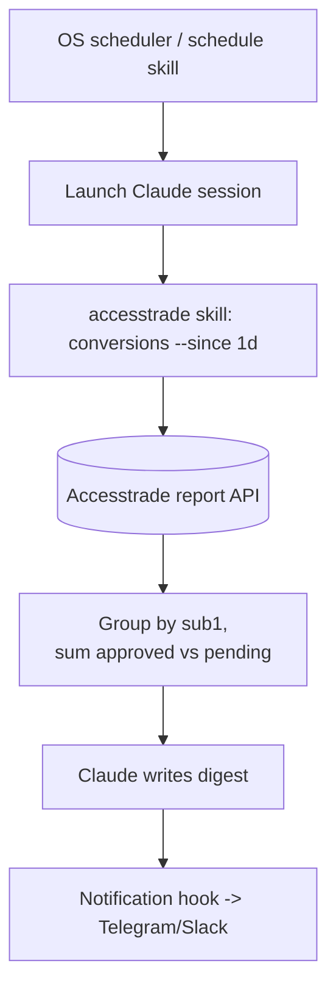

# Use case - automated daily conversion digest

**Goal: every morning, Claude pulls yesterday's conversions, separates approved vs pending revenue, ranks the top-earning content by `sub1`, and sends a one-paragraph digest to your phone.** This turns the [[Accesstrade conversion and transaction reporting|reporting API]] into a passive dashboard you never open.

## Flow

## Build recipe

1. **Schedule** a daily Claude run (cron / the `schedule` or `loop` skill).
2. The [[Designing an Accesstrade skill for Claude Code|accesstrade skill]] fetches a trailing-24h (or 7d) window — well within the [[Accesstrade API rate limits and pagination|1-req/5-min, 7-day]] limit.
3. Claude aggregates: total approved, total pending, top 5 `sub1` by reward, biggest single sale, any newly-rejected conversions.
4. A **`Notification` or `Stop` hook** forwards the digest to Telegram/Slack/Zalo (installers already exist in this vault).

## Why it works well

- **Incremental:** use `periodBase = UPDATED_DATE` so you also catch yesterday's pending sales that flipped to approved today.
- **Cheap context:** run the pull in a `context: fork` subagent; only the finished digest returns to your main thread.
- **Honest numbers:** approved and pending are reported separately so you never celebrate revenue a merchant later cancels.

## Variations

- Weekly EPC-by-content report (revenue ÷ clicks per `sub1`).
- Alert-only mode: stay silent unless a threshold (e.g. >1M VND/day or a rejection spike) is crossed.

## Related

- [[Accesstrade conversion and transaction reporting]]
- [[Accesstrade API rate limits and pagination]]
- [[3 Resources/AI/Claude-Code/Hooks/Claude Code hooks event model]]
- [[Accesstrade SubID attribution]]
- [[Accesstrade API Integration - MOC]]
