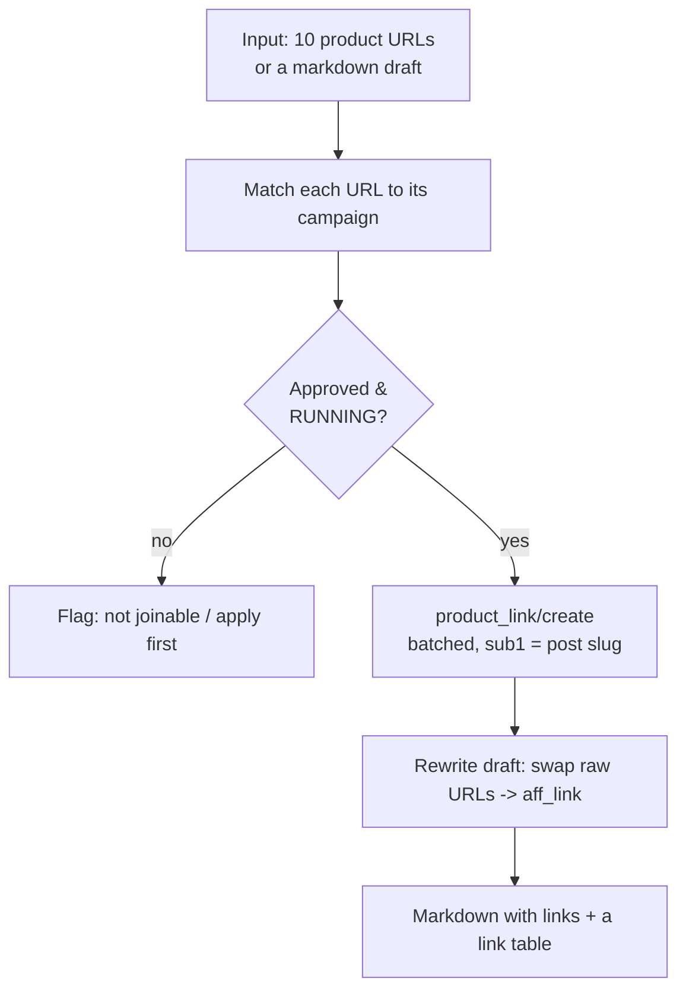

# Use case - bulk tracking link generation

**Goal: hand Claude a list of product URLs (or a draft article) and get back attributed affiliate links — correctly campaign-matched, consistently SubID-tagged, and ready to paste — in one pass.** This removes the most tedious, error-prone affiliate chore.

## Flow

## Build recipe

1. Claude resolves each URL's merchant → [[Accesstrade Campaigns API|campaign]] (and flags any you're not approved on, so you can apply first).
2. Calls [[Accesstrade tracking link creation|`product_link/create`]] **batched** (multiple `urls` per request), stamping a consistent `sub1` = the content slug — see [[Accesstrade SubID attribution]].
3. Returns both a **link table** (origin → `aff_link` → `short_link`) and, if you gave a draft, the **rewritten article** with links swapped in.

## Guardrails (where hooks earn their keep)

- A **`PreToolUse` hook** denies minting against a paused/unapproved campaign, so you never ship a dead link — see [[Affiliate automation hook patterns]].
- A **`PostToolUse` hook** appends every minted link to a ledger CSV for later reconciliation against conversions.

## Efficiency notes

- **Idempotency:** cache by `(campaign_id, url, subs)`; identical inputs return the same link, so re-runs don't spam the API — see [[Affiliate API engineering best practices]].
- Disclose affiliate relationships in the output template — see [[Affiliate compliance and link hygiene]].

## Related

- [[Accesstrade tracking link creation]]
- [[Accesstrade Campaigns API]]
- [[Affiliate automation hook patterns]]
- [[Affiliate compliance and link hygiene]]
- [[Accesstrade API Integration - MOC]]
