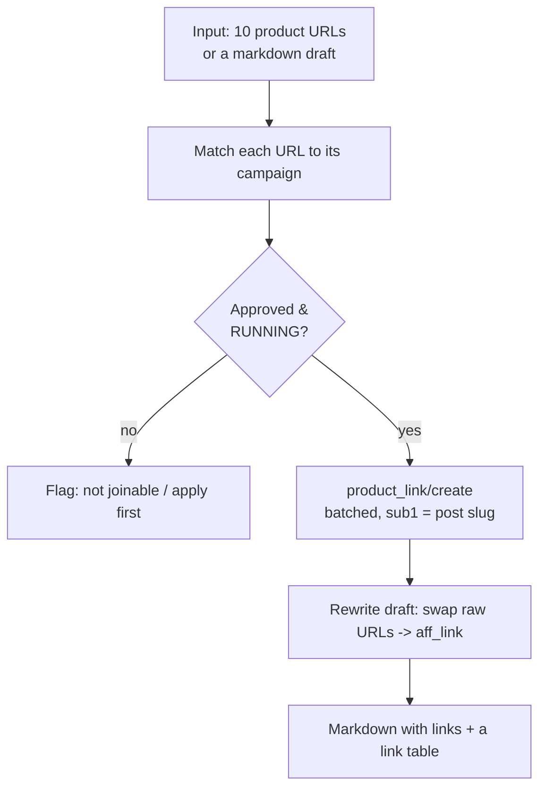

# Use case - bulk tracking link generation

**Goal: hand Claude a list of product URLs (or a draft article) and get back attributed affiliate links — correctly campaign-matched, consistently SubID-tagged, and ready to paste — in one pass.** This removes the most tedious, error-prone affiliate chore.

## Flow

## Build recipe

1. Claude resolves each URL's merchant → [[Accesstrade Campaigns API|campaign]] (and flags any you're not approved on, so you can apply first).
2. Calls [[Accesstrade tracking link creation|`product_link/create`]] **batched** (multiple `urls` per request), stamping a consistent `sub1` = the content slug — see [[Accesstrade SubID attribution]].
3. Returns both a **link table** (origin → `aff_link` → `short_link`) and, if you gave a draft, the **rewritten article** with links swapped in.

## Guardrails (where hooks earn their keep)

- A **`PreToolUse` hook** denies minting against a paused/unapproved campaign, so you never ship a dead link — see [[3 Resources/AI/Claude-Code/Hooks/Claude Code hooks event model]].
- A **`PostToolUse` hook** appends every minted link to a ledger CSV for later reconciliation against conversions.

## Efficiency notes

- **Idempotency:** cache by `(campaign_id, url, subs)`; identical inputs return the same link, so re-runs don't spam the API — see [[Affiliate API engineering best practices]].
- Disclose affiliate relationships in the output template — see [[Affiliate compliance and link hygiene]].

## Related

- [[Accesstrade tracking link creation]]
- [[Accesstrade Campaigns API]]
- [[3 Resources/AI/Claude-Code/Hooks/Claude Code hooks event model]]
- [[Affiliate compliance and link hygiene]]
- [[Accesstrade API Integration - MOC]]

%% ai-graph-start %%

**Related notes:**
- [[Accesstrade API Integration - MOC]]
- [[Affiliate compliance and link hygiene]]
- [[Use case - campaign discovery and datafeed content briefs]]
- [[Designing an Accesstrade skill for Claude Code]]
- [[Claude Code hooks event model]]

**Relations:**
- Claude — *generates* — attributed affiliate link
- Claude — *receives* — product URL
- Claude — *receives* — draft article
- attributed affiliate link — *is* — campaign-matched
- attributed affiliate link — *is* — SubID-tagged
- bulk tracking link generation — *removes* — affiliate chore
- affiliate chore — *is* — tedious
- affiliate chore — *is* — error-prone
- Claude — *resolves* — merchant
- merchant — *maps to* — campaign
- campaign — *managed by* — Accesstrade Campaigns API
- Claude — *flags* — unapproved campaign
- unapproved campaign — *requires* — application
- Claude — *calls* — product_link/create
- product_link/create — *is* — batched
- product_link/create — *handles* — multiple product URL
- product_link/create — *stamps* — sub1
- sub1 — *is* — content slug
- sub1 — *relates to* — Accesstrade SubID attribution
- Claude — *returns* — link table
- link table — *contains* — origin
- link table — *contains* — aff_link
- link table — *contains* — short_link
- Claude — *returns* — rewritten article
- rewritten article — *contains* — swapped links
- PreToolUse hook — *denies* — minting
- minting — *is against* — paused campaign
- minting — *is against* — unapproved campaign
- PreToolUse hook — *prevents* — dead link
- PreToolUse hook — *is a type of* — Claude Code hooks event model
- PostToolUse hook — *appends* — minted link
- PostToolUse hook — *appends to* — ledger CSV
- ledger CSV — *is for* — reconciliation against conversions
- Idempotency — *caches by* — campaign_id
- Idempotency — *caches by* — product URL
- Idempotency — *caches by* — SubID
- Idempotency — *prevents* — API spamming
- Idempotency — *is a part of* — Affiliate API engineering best practices
- output template — *discloses* — affiliate relationship
- affiliate relationship — *relates to* — Affiliate compliance and link hygiene
- bulk tracking link generation — *related to* — Accesstrade tracking link creation
- bulk tracking link generation — *related to* — Accesstrade Campaigns API
- bulk tracking link generation — *related to* — Claude Code hooks event model
- bulk tracking link generation — *related to* — Affiliate compliance and link hygiene
- bulk tracking link generation — *related to* — Accesstrade API Integration - MOC
- raw URL — *swapped to* — aff_link
- product URL — *matched to* — campaign
- sub1 — *is* — post slug
- product_link/create — *uses* — post slug

%% ai-graph-end %%