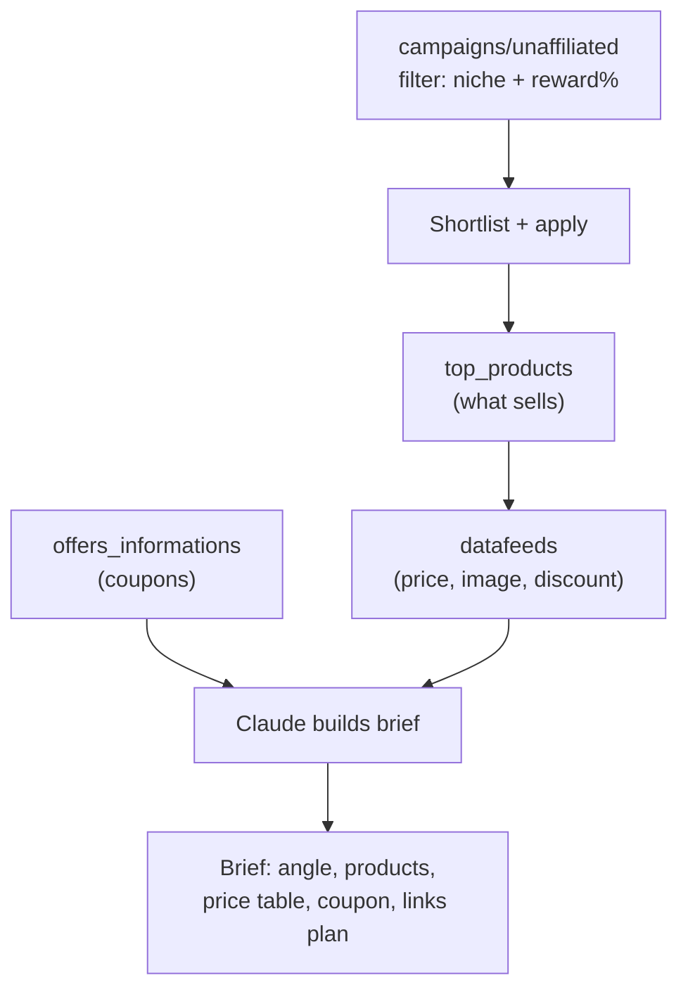

# Use case - campaign discovery and datafeed content briefs

**Goal: let Claude scout high-reward campaigns in your niche, pull their product datafeed and live coupons, and produce a ready-to-write content brief grounded in real prices and best-sellers.** This is the front of the funnel — turning the API's discovery endpoints into a publishing plan.

## Flow

## Build recipe

1. **Discover:** filter [[Accesstrade Campaigns API|unaffiliated campaigns]] by category and reward rate; Claude shortlists and (optionally) applies via `POST campaigns/affiliate`.
2. **Rank demand:** [[Accesstrade Promotions and Top Products APIs|`top_products`]] reveals validated sellers; sort by sales.
3. **Enrich:** [[Accesstrade Datafeeds API|`datafeeds`]] supplies current price, discount, and image per product; `offers_informations` supplies a coupon hook.
4. **Brief:** Claude drafts a content brief — angle, target keyword, the 5–8 products to feature, a price/spec comparison table, the coupon CTA, and a [[Use case - bulk tracking link generation|link plan]].

## Why combine these endpoints

Each read endpoint alone is weak; together they answer the three questions content needs — *what pays well* (campaign reward), *what sells* (top products), *what's the offer* (price + coupon). Claude is the synthesis layer that the raw JSON can't be.

> [!tip] Ranking signal
> If you have history, rank candidate products by **EPC** (earnings per click) from your own [[Accesstrade conversion and transaction reporting|conversion data]] joined on `sub1`, not just by merchant-reported sales. Your audience ≠ the average.

## Related

- [[Accesstrade Campaigns API]]
- [[Accesstrade Datafeeds API]]
- [[Accesstrade Promotions and Top Products APIs]]
- [[Use case - bulk tracking link generation]]
- [[Accesstrade API Integration - MOC]]

%% ai-graph-start %%

**Related notes:**
- [[Accesstrade Datafeeds API]]
- [[Accesstrade Promotions and Top Products APIs]]
- [[Use case - bulk tracking link generation]]
- [[Affiliate content-brief generator produces the grounded skeleton, not the prose]]
- [[Accesstrade Campaigns API]]

**Relations:**
- Campaign Discovery and Datafeed Content Briefs — *is a* — Use Case
- Claude — *scouts* — High-Reward Campaigns
- Claude — *pulls* — Product Datafeed
- Claude — *pulls* — Live Coupons
- Claude — *produces* — Content Brief
- Content Brief — *is grounded in* — Price
- Content Brief — *is grounded in* — Featured Products
- API Discovery Endpoints — *inform* — Publishing Plan
- campaigns/unaffiliated — *filters by* — Niche
- campaigns/unaffiliated — *filters by* — Reward Rate
- campaigns/unaffiliated — *informs* — Shortlisting Campaigns
- Shortlisting Campaigns — *leads to* — Applying for Campaigns
- Applying for Campaigns — *informs* — top_products
- top_products — *reveals* — Validated Sellers
- top_products — *sorts by* — Sales
- top_products — *informs* — datafeeds
- datafeeds — *supplies* — Price
- datafeeds — *supplies* — Image
- datafeeds — *supplies* — Discount
- datafeeds — *informs* — Claude
- offers_informations — *supplies* — Coupon Hook
- offers_informations — *informs* — Claude
- Claude — *builds* — Content Brief
- Content Brief — *includes* — Brief Angle
- Content Brief — *includes* — Target Keyword
- Content Brief — *includes* — Featured Products
- Content Brief — *includes* — Price/Spec Comparison Table
- Content Brief — *includes* — Coupon CTA
- Content Brief — *includes* — Link Plan
- Accesstrade Campaigns API — *provides* — campaigns/unaffiliated
- Accesstrade Promotions and Top Products APIs — *provides* — top_products
- Accesstrade Datafeeds API — *provides* — datafeeds
- Accesstrade Campaigns API — *supports* — Campaign Discovery and Datafeed Content Briefs
- Accesstrade Datafeeds API — *supports* — Campaign Discovery and Datafeed Content Briefs
- Accesstrade Promotions and Top Products APIs — *supports* — Campaign Discovery and Datafeed Content Briefs
- EPC — *is a* — Ranking Signal
- EPC — *is derived from* — Conversion Data
- Conversion Data — *joined on* — sub1
- EPC — *is preferred over* — Merchant-Reported Sales
- Link Plan — *is generated by* — Use case - bulk tracking link generation
- Accesstrade API Integration - MOC — *integrates* — Accesstrade Campaigns API
- Claude — *is a* — synthesis layer
- synthesis layer — *processes* — raw JSON
- History — *provides* — Conversion Data
- Audience — *differs from* — average
- Reward Rate — *answers* — what pays well
- top_products — *answers* — what sells
- Price — *answers* — what's the offer
- Coupon Hook — *answers* — what's the offer
- POST campaigns/affiliate — *is used for* — Applying for Campaigns

%% ai-graph-end %%