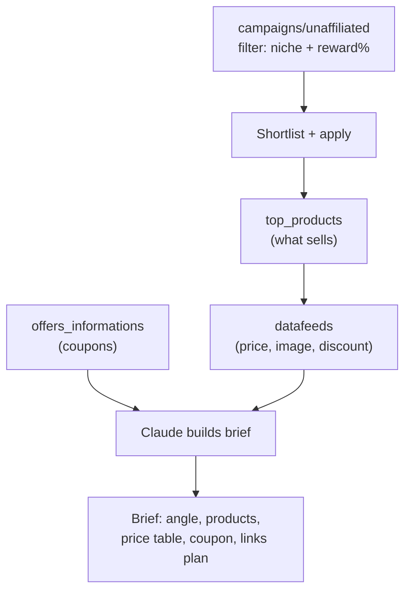

# Use case - campaign discovery and datafeed content briefs

**Goal: let Claude scout high-reward campaigns in your niche, pull their product datafeed and live coupons, and produce a ready-to-write content brief grounded in real prices and best-sellers.** This is the front of the funnel — turning the API's discovery endpoints into a publishing plan.

## Flow

## Build recipe

1. **Discover:** filter [[Accesstrade Campaigns API|unaffiliated campaigns]] by category and reward rate; Claude shortlists and (optionally) applies via `POST campaigns/affiliate`.
2. **Rank demand:** [[Accesstrade Promotions and Top Products APIs|`top_products`]] reveals validated sellers; sort by sales.
3. **Enrich:** [[Accesstrade Datafeeds API|`datafeeds`]] supplies current price, discount, and image per product; `offers_informations` supplies a coupon hook.
4. **Brief:** Claude drafts a content brief — angle, target keyword, the 5–8 products to feature, a price/spec comparison table, the coupon CTA, and a [[Use case - bulk tracking link generation|link plan]].

## Why combine these endpoints

Each read endpoint alone is weak; together they answer the three questions content needs — *what pays well* (campaign reward), *what sells* (top products), *what's the offer* (price + coupon). Claude is the synthesis layer that the raw JSON can't be.

> [!tip] Ranking signal
> If you have history, rank candidate products by **EPC** (earnings per click) from your own [[Accesstrade conversion and transaction reporting|conversion data]] joined on `sub1`, not just by merchant-reported sales. Your audience ≠ the average.

## Related

- [[Accesstrade Campaigns API]]
- [[Accesstrade Datafeeds API]]
- [[Accesstrade Promotions and Top Products APIs]]
- [[Use case - bulk tracking link generation]]
- [[Accesstrade API Integration - MOC]]
