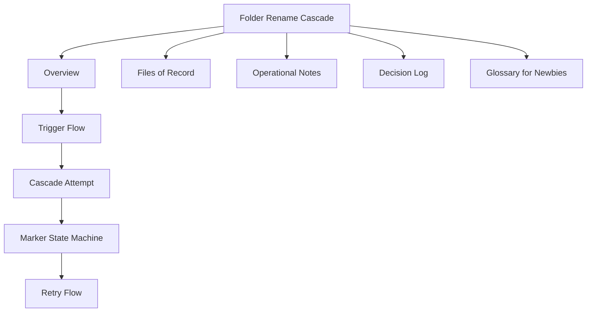

# Folder Rename Cascade

> Ticket: **LUZ-154157** - eArchive backend P1.4.3 cascade changes
> Branch: `kepler/sprint-157/LUZ-154157-...`
> Status: rolled out to dev (latest tag `3661b7c`)

## Start here

This note explains what happens when a folder is renamed and the system must update every document that stores that folder name.

If you are new to the topic, read in this order:

1. [[1 Projects/luz-docs/materialize/cascades/Folder Rename Cascade/technical-points/01 Overview - Folder Rename Cascade|Overview]]
2. [[1 Projects/luz-docs/materialize/cascades/Folder Rename Cascade/technical-points/02 Trigger Flow|Trigger flow]]
3. [[1 Projects/luz-docs/materialize/cascades/Folder Rename Cascade/technical-points/03 Cascade Attempt|Cascade attempt]]
4. [[1 Projects/luz-docs/materialize/cascades/Folder Rename Cascade/technical-points/04 Marker State Machine|Marker state machine]]
5. [[1 Projects/luz-docs/materialize/cascades/Folder Rename Cascade/technical-points/05 Retry Flow|Retry flow]]
6. [[1 Projects/luz-docs/materialize/cascades/Folder Rename Cascade/technical-points/06 Files of Record|Files of record]]
7. [[1 Projects/luz-docs/materialize/cascades/Folder Rename Cascade/technical-points/07 Operational Notes|Operational notes]]
8. [[1 Projects/luz-docs/materialize/cascades/Folder Rename Cascade/technical-points/08 Decision Log|Decision log]]
9. [[1 Projects/luz-docs/materialize/cascades/Folder Rename Cascade/technical-points/09 Glossary for Newbies|Glossary for newbies]]

## TL;DR

When a folder is renamed through `PUT /folders/{id}` or `PATCH /folders/{id}`, every document that references that folder must update the matching entry in its materialized `_folderNames` array.

The update runs on the server in one MongoDB aggregation-pipeline `updateMany`, without paging through documents one page at a time. If MongoDB reports that some matched documents were not modified, the system keeps a row in the tenant's `materializeCascade` collection so a later request can retry the unfinished work.

## Obsidian map



## Key idea in plain English

Think of a document as storing two matching lists:

```text
folderIds:     [123, 456]
_folderNames:  [Inbox, Contracts]
```

If folder `456` is renamed from `Contracts` to `Legal`, the system only changes the second name:

```text
folderIds:     [123, 456]
_folderNames:  [Inbox, Legal]
```

The folder ID stays stable. Only the stored display name changes.

%% ai-graph-start %%

**Related notes:**
- [[01 Overview - Folder Rename Cascade]]
- [[03 Cascade Attempt]]
- [[07 Operational Notes]]
- [[02 Trigger Flow]]
- [[luz_docs has two materialize cascade delivery mechanisms]]

**Relations:**
- Folder Rename Cascade — *is associated with ticket* — LUZ-154157
- LUZ-154157 — *describes* — eArchive backend P1.4.3 cascade changes
- Folder Rename Cascade — *uses branch* — kepler/sprint-157/LUZ-154157-...
- Folder Rename Cascade — *rolled out to* — dev
- dev — *has latest tag* — 3661b7c
- Folder Rename Cascade — *explains* — folder rename
- folder rename — *requires system to update* — document
- Folder Rename Cascade — *has part* — Overview
- Folder Rename Cascade — *has part* — Trigger Flow
- Folder Rename Cascade — *has part* — Cascade Attempt
- Folder Rename Cascade — *has part* — Marker State Machine
- Folder Rename Cascade — *has part* — Retry Flow
- Folder Rename Cascade — *has part* — Files of Record
- Folder Rename Cascade — *has part* — Operational Notes
- Folder Rename Cascade — *has part* — Decision Log
- Folder Rename Cascade — *has part* — Glossary for Newbies
- Overview — *is followed by* — Trigger Flow
- Trigger Flow — *is followed by* — Cascade Attempt
- Cascade Attempt — *is followed by* — Marker State Machine
- Marker State Machine — *is followed by* — Retry Flow
- folder — *is renamed via* — PUT /folders/{id}
- folder — *is renamed via* — PATCH /folders/{id}
- document — *references* — folder
- document — *must update* — _folderNames
- update — *runs on* — server
- update — *uses* — MongoDB
- update — *uses* — aggregation-pipeline
- update — *uses* — updateMany
- system — *stores unfinished work in* — materializeCascade collection
- materializeCascade collection — *is for* — tenant
- document — *stores* — folderIds
- document — *stores* — _folderNames
- folderIds — *is matched with* — _folderNames
- _folderNames — *stores* — display name
- folderIds — *stays stable during* — folder rename

%% ai-graph-end %%