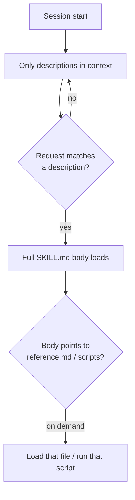

# Claude Code Skill anatomy

**A Claude Code "skill" is a folder containing a `SKILL.md` file whose YAML frontmatter tells Claude *when* to use it and whose markdown body tells Claude *what* to do — loaded lazily so it costs almost no context until it's actually invoked.** This progressive disclosure is what lets a skill bundle large reference material (like a full API spec) cheaply.

## The folder

```text
accesstrade/
├── SKILL.md          # required: frontmatter + instructions
├── reference.md      # loaded only when needed (full endpoint list)
├── examples.md       # sample outputs
└── scripts/
    └── at.py         # executed, not loaded into context
```

## Frontmatter that matters

```yaml
---
name: accesstrade
description: Query the Accesstrade affiliate API — campaigns, links, reports. Use when the user asks about Accesstrade earnings, tracking links, or campaigns.
allowed-tools: Bash(python3 *)
disable-model-invocation: false
---
```

| Field | Why it matters |
|---|---|
| `description` (+ `when_to_use`) | how Claude decides to auto-load it; **put the key use case first** (capped ~1,536 chars) |
| `allowed-tools` | pre-approve tools (e.g. the script) so the skill runs without permission prompts |
| `disable-model-invocation: true` | manual-only (`/deploy`-style) — use for side-effecting actions |
| `context: fork` + `agent` | run the skill in an isolated subagent |
| `${CLAUDE_SKILL_DIR}` | path to bundled scripts, regardless of cwd |

## Progressive disclosure (the core idea)



Three tiers: **(1)** descriptions always present, **(2)** body loads on invoke and *stays for the session*, **(3)** supporting files/scripts load or execute only when referenced. Keep the body concise — once loaded it's a recurring token cost.

## Dynamic context injection

A `` !`command` `` line (or a ` ```! ` block) runs **before** Claude sees the skill, and its output is inlined. Great for grounding a skill in live data — e.g. `` !`python3 ${CLAUDE_SKILL_DIR}/scripts/at.py campaigns` `` drops the current campaign list straight into the prompt.

## Related

- [[Designing an Accesstrade skill for Claude Code]]
- [[Claude Code hooks event model]]
- [[Skills vs Hooks vs MCP vs subagents]]
- [[Accesstrade API Integration - MOC]]

%% ai-graph-start %%

**Related notes:**
- [[Designing an Accesstrade skill for Claude Code]]
- [[Accesstrade API Integration - MOC]]
- [[Skills vs Hooks vs MCP vs subagents]]
- [[Claude Code hooks event model]]
- [[Use case - bulk tracking link generation]]

%% ai-graph-end %%