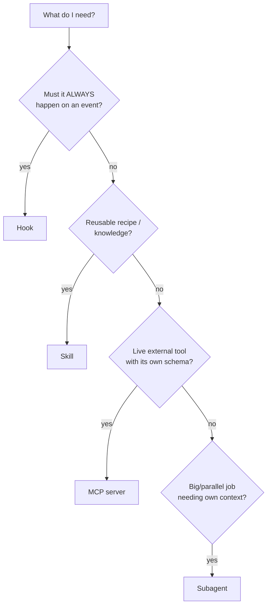

# Skills vs Hooks vs MCP vs subagents

**Pick the primitive by *who triggers it* and *whether it must always run*: skills are model-invoked knowledge/recipes, hooks are deterministic event-fired guardrails, MCP servers are live tool connections, and subagents are isolated workers.** Most affiliate setups use a *combination*, not one.

| Primitive | Triggered by | Guarantee | Best affiliate fit |
|---|---|---|---|
| **Skill** | model or `/name` | advisory (may run) | the Accesstrade "playbook" + script |
| **Hook** | lifecycle event | deterministic (always) | guard link-mints, log ledger, postback sink |
| **MCP server** | model calls its tools | live connection, schema'd tools | a hosted Accesstrade tool server / Slack |
| **Subagent** | delegated by main loop | isolated context | heavy report crawls, parallel content drafts |

## Decision flow

## How they compose for Accesstrade

- A **skill** (`accesstrade`) holds the recipes and the script that talks to the API.
- **Hooks** enforce the rails around it (no minting on paused campaigns; log every link; forward conversions).
- An **MCP server** is worth it only if you want the API available as typed tools across many sessions/clients, or to bridge Slack/notifications.
- **Subagents** (`context: fork`) absorb the long, windowed report pulls so the main chat stays lean.

> [!tip]
> Rule of thumb: **knowledge → skill, enforcement → hook, integration → MCP, scale/isolation → subagent.**

## Related

- [[Claude Code Skill anatomy]]
- [[Claude Code hooks event model]]
- [[Designing an Accesstrade skill for Claude Code]]
- [[Accesstrade API Integration - MOC]]
