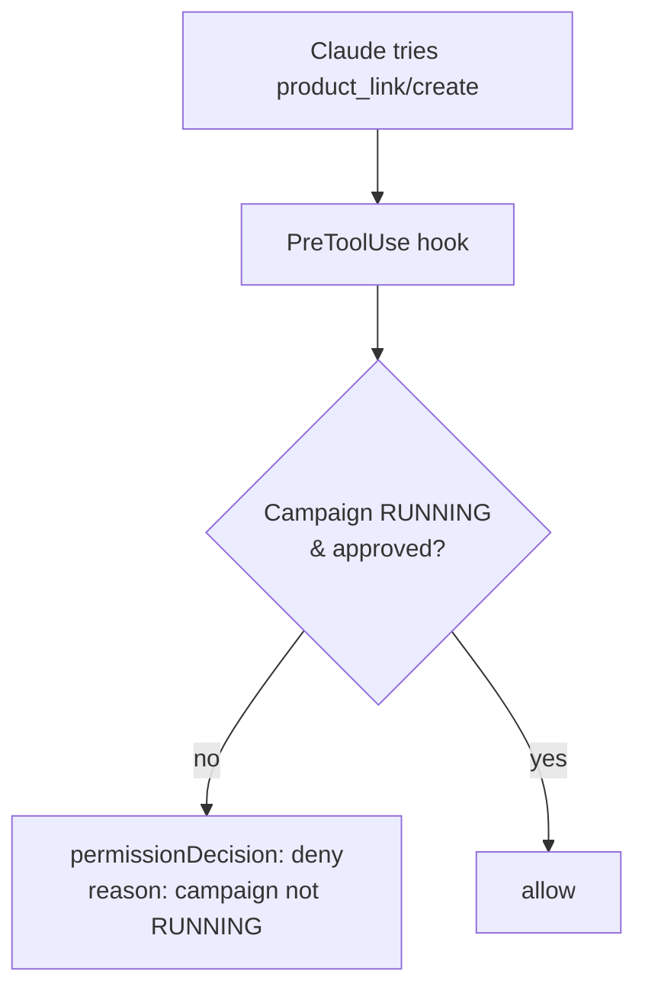

# Affiliate automation hook patterns

**The high-value hooks for affiliate work fall into three jobs: inject fresh data so Claude is grounded, guard money-moving actions, and capture/forward outcomes.** Each maps to a specific [[Claude Code hooks event model|hook event]].

## 1. Ground Claude in live numbers — `UserPromptSubmit` / `SessionStart`

Inject a small earnings snapshot so every answer is current without Claude having to call the API first.

```bash
# SessionStart hook -> stdout JSON
echo '{"hookSpecificOutput":{"hookEventName":"SessionStart",
  "additionalContext":"Last 24h: 7 conversions, 540k VND pending, 1.2M approved."}}'
```

## 2. Guard the link-mint — `PreToolUse`

Block tracking-link creation against a campaign that isn't `RUNNING`, or one you're not approved on — the most common cause of *unpaid* clicks.



## 3. Capture & forward outcomes — `PostToolUse` / `Stop` / `Notification`

- `PostToolUse` (matcher on the link call): append every minted `aff_link` + `sub1` to a CSV ledger.
- `Stop`: write a one-line session summary, or trigger the daily digest skill.
- `Notification` → Slack/Telegram/Zalo so a conversion ping reaches your phone (this vault already has Telegram/Zalo/Slack hook installers).

## 4. Real-time conversions — `http` hook as a postback sink

Point Accesstrade's [[Accesstrade postback and S2S conversion tracking|postback URL]] at an HTTP hook endpoint; on each event, enrich the SubID → content mapping and notify.

## Scheduling note

Hooks fire on *Claude's* lifecycle, not the clock. For time-based jobs (a daily pull) use the OS scheduler or the `schedule`/`loop` skills to launch a Claude session, and let `SessionStart`/`Stop` hooks do the wiring. See [[Use case - automated daily conversion digest]].

## Related

- [[Claude Code hooks event model]]
- [[Accesstrade postback and S2S conversion tracking]]
- [[Secrets handling for affiliate API keys]]
- [[Use case - automated daily conversion digest]]
- [[Accesstrade API Integration - MOC]]
