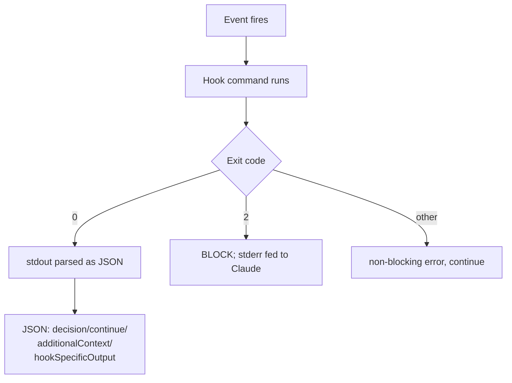

# Claude Code hooks event model

**Hooks are shell/HTTP commands Claude Code runs *deterministically* at defined lifecycle events — they fire whether or not the model "decides" to, which is exactly what you want for guardrails and automation that must always happen.** Where a skill is advisory (the model may or may not use it), a hook is enforced.

## The events you'll actually use for affiliate work

| Event | Fires when… | Affiliate use |
|---|---|---|
| `UserPromptSubmit` | you submit a prompt | inject today's earnings snapshot as context |
| `PreToolUse` | before a tool runs (can block) | block a link-mint to a non-`RUNNING` campaign |
| `PostToolUse` | after a tool succeeds | log every minted link to a ledger |
| `Stop` | Claude finishes responding | append a session summary / send digest |
| `Notification` | Claude sends a notification | forward to Slack/Telegram |
| `SessionStart` | session begins/resumes | preload campaign list |

(There are many more — `SubagentStop`, `PreCompact`, `SessionEnd`, etc.)

## Configuration shape (`settings.json`)

```json
{
  "hooks": {
    "PostToolUse": [
      {
        "matcher": "Bash",
        "hooks": [
          { "type": "command",
            "command": "${CLAUDE_PROJECT_DIR}/.claude/hooks/log-link.sh",
            "if": "Bash(*product_link*)", "timeout": 30 }
        ]
      }
    ]
  }
}
```

- **matcher** filters by tool (`Bash`, `Edit|Write`, regex, or `*`).
- Handler **types**: `command`, `http`, `mcp_tool`, `prompt`, `agent`.

## How a hook talks back



- **Exit 0** → stdout may be JSON: `additionalContext` (inject info), `decision: "block"` + `reason`, `continue: false`.
- **Exit 2** → hard block; stderr is shown to Claude.
- `PreToolUse` uses `hookSpecificOutput.permissionDecision` = `allow` / `deny` / `ask`.

## Related

- [[Affiliate automation hook patterns]]
- [[Claude Code Skill anatomy]]
- [[Skills vs Hooks vs MCP vs subagents]]
- [[Accesstrade postback and S2S conversion tracking]]
- [[Accesstrade API Integration - MOC]]
