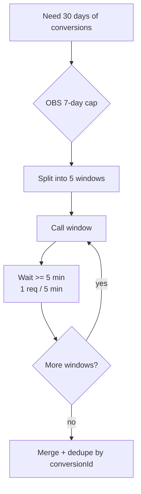

# Accesstrade API rate limits and pagination

**Accesstrade meters its heavier reporting endpoints aggressively and paginates list endpoints, so any automation must page through results and back off rather than poll tightly.** The headline constraint comes from the OBS conversion report.

## The limits that bite

- **Conversion report (OBS):** documented at **1 request per 5 minutes**, and the `fromDate`/`toDate` window is capped at **7 days** per call. To cover a month you must make ~5 windowed calls, spaced ≥5 min apart.
- List endpoints return a **page** of rows; you must loop `page`/`limit` until a short/empty page signals the end.

## Pagination conventions by generation

| Concern | Classic `.vn` | OBS `.global` |
|---|---|---|
| Page controls | `page`, `limit` | `page`, `limit` (defaults page=1, limit=10) |
| Date range | `since`, `until` (required on txns/orders) | `fromDate`, `toDate` (ISO `yyyy-MM-ddTHH:mm:ss`, often URL-encoded with TZ) |
| Date semantics | by record time | `periodBase`: `CONVERSION_DATE` / `CONFIRMATION_DATE` / `POSTBACK_ERROR_DATE` / `UPDATED_DATE` |

## Design implications

- **Cache** report results locally; never re-pull the same window on every run — see [[Affiliate API engineering best practices]].
- Use `periodBase: UPDATED_DATE` to fetch only rows whose status *changed* since the last sync (incremental pulls), instead of re-reading the whole history.
- For a daily job, a single trailing-24h (or trailing-7d) window respects the cadence comfortably.

## Related

- [[Accesstrade conversion and transaction reporting]]
- [[Affiliate API engineering best practices]]
- [[Use case - automated daily conversion digest]]
- [[Accesstrade API Integration - MOC]]
