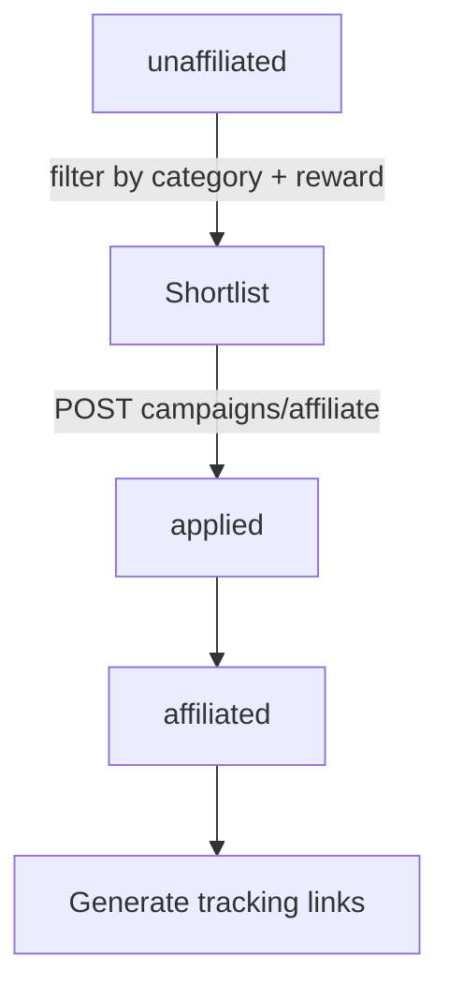

# Accesstrade Campaigns API

**The Campaigns API is how a publisher discovers merchant offers, inspects their reward rules, and applies to join — it is the entry point of the whole affiliate loop.** A tracking link can only be made for a campaign you are approved on, so this API gates everything downstream.

## Classic `.vn`

- `GET /v1/campaigns` — list campaigns. Filters: `approval` (e.g. `approval=successful` = ones you're approved on), `campaign_id`.
- A companion **commission-ratio** list returns reward percentages per campaign.

## Global OBS (site-scoped)

Campaigns are grouped by your relationship to them:

| Endpoint | Returns |
|---|---|
| `GET /v1/publishers/me/sites/{siteId}/campaigns/affiliated` | already approved |
| `.../campaigns/applied` | application pending |
| `.../campaigns/rejected` | application rejected |
| `.../campaigns/unaffiliated` | available, not yet joined |
| `GET /v1/campaigns/{campaignId}?siteId=` | full detail: dates, rewards, budget, description |
| `GET /v1/publishers/me/campaigns/campaign-status?campaignId=` | operational state |
| `POST /v1/campaigns/affiliate` | **apply** — body `{ siteId, campaignIds[] }` |

Common query params on the list endpoints: `keyword`, `categories`, `campaignTypes`, `customerCountries`, plus required `limit`, `page`.

Campaign **status** values: `GETTING_READY`, `RUNNING`, `PAUSED`, `TERMINATED`, `WONT_RUN`, `OTHER`. Don't generate links for anything but `RUNNING`.

## Automation angle

This is the natural first step for a Claude skill: *"find RUNNING campaigns in <niche> with reward ≥ X% I'm not yet on, and apply."* See [[Use case - campaign discovery and datafeed content briefs]].

## Related

- [[Accesstrade tracking link creation]]
- [[Accesstrade Datafeeds API]]
- [[Use case - campaign discovery and datafeed content briefs]]
- [[Accesstrade API Integration - MOC]]
