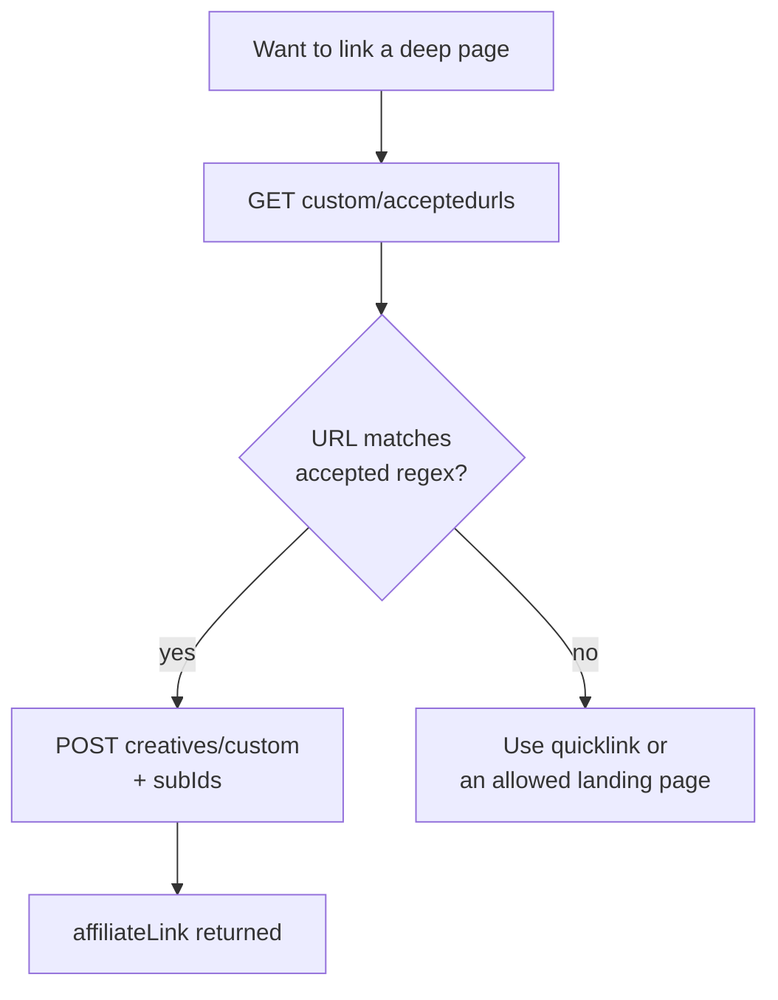

# Accesstrade Creative APIs

**On the global OBS API, "creatives" are the merchant-approved promotional assets — banners, text snippets, and ready-made affiliate links — that you embed in content; they are the OBS equivalent of the classic API's link-creation flow.** They keep you compliant by only emitting links to merchant-approved landing pages.

## Endpoints (OBS, all under `/v1/publishers/me/sites/{siteId}/campaigns/{campaignId}/creatives/`)

| Endpoint | Returns |
|---|---|
| `GET .../image` | banner creatives: image URL, dimensions, affiliate image link |
| `GET .../text` | text creatives: copy with embedded tracking link |
| `GET .../quicklink` | a single ready `affiliateLink` for the campaign |
| `GET .../custom/acceptedurls` | the `landingUrls` you're allowed to deep-link, with validation regex |
| `POST .../custom` | build a branded link: `landingUrl` *(required)*, `imageUrl`, `anchorText`, `name`, `subIds` |

## The key safety rail: accepted URLs

`POST .../custom` will only mint a link for a `landingUrl` that matches the merchant's **accepted-URL regex** (from `.../custom/acceptedurls`). This prevents you from deep-linking to pages the advertiser hasn't authorized — a frequent cause of rejected conversions.

## Classic vs OBS

On the classic `.vn` API you mint links directly with [[Accesstrade tracking link creation|product_link/create]]. On OBS, the **quicklink / custom creative** endpoints play that role, with the accepted-URL guardrail baked in.

## Related

- [[Accesstrade tracking link creation]]
- [[Accesstrade has two API generations]]
- [[Affiliate compliance and link hygiene]]
- [[Accesstrade API Integration - MOC]]
