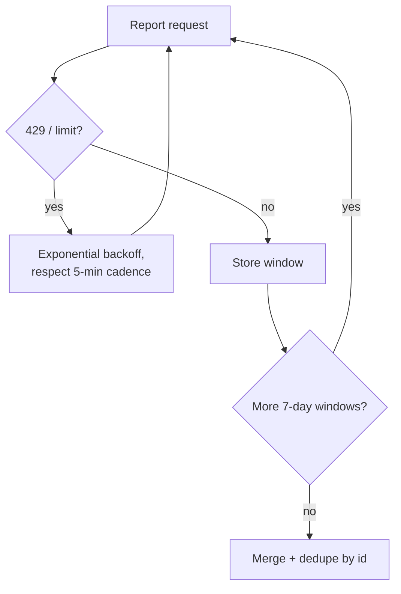

# Affiliate API engineering best practices

**Treat the Accesstrade API as rate-limited, eventually-consistent, and money-critical: cache reads, back off on limits, make writes idempotent, and reconcile against the report API as the source of truth.** These four habits prevent the failure modes that cost real commission.

## 1. Cache reads; pull incrementally

- Persist datafeeds, campaign lists, and report windows locally; refresh on a schedule, not on every prompt.
- For conversions, sync incrementally with `periodBase = UPDATED_DATE` instead of re-reading all history — respects the [[Accesstrade API rate limits and pagination|5-min/7-day]] limit.

## 2. Back off and window

## 3. Make writes idempotent

- Key minted links by `(campaign_id, origin_url, subs)` and cache the result; the same inputs always map to the same `aff_link`, so never re-mint blindly.
- Before applying to a campaign, check current affiliation state to avoid duplicate/again-rejected applications.

## 4. Reconcile, don't trust a single read

- Conversions are **eventually consistent**: pending can flip to approved or rejected days later. The report API (status-aware) is the **source of truth**; treat [[Accesstrade postback and S2S conversion tracking|postbacks]] as fast-but-lean signals to be confirmed later.
- Always separate **approved** from **pending** in any total.

## 5. Defensive details

- URL-encode date params; mind timezones (OBS dates carry TZ).
- Identify the [[Accesstrade has two API generations|API generation]] before copying any query — casing and paths differ.
- Log raw responses (minus secrets) so you can debug attribution disputes.

## Related

- [[Accesstrade API rate limits and pagination]]
- [[Accesstrade conversion and transaction reporting]]
- [[Accesstrade postback and S2S conversion tracking]]
- [[Affiliate compliance and link hygiene]]
- [[Accesstrade API Integration - MOC]]
