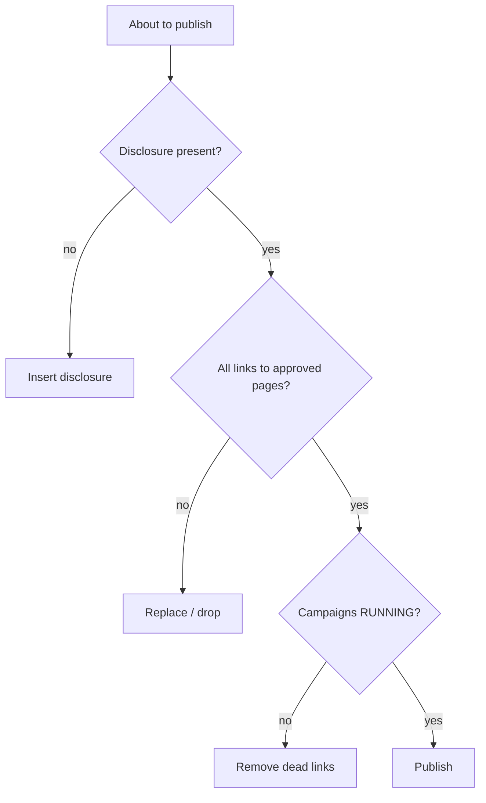

# Affiliate compliance and link hygiene

**Automated link generation scales mistakes as fast as output, so bake compliance into the template: disclose the affiliate relationship, only deep-link to approved pages, and keep links healthy.** Conversions get rejected — or accounts get banned — for exactly these omissions.

## Disclosure (non-negotiable)

- Every page/post with affiliate links carries a clear disclosure ("this post contains affiliate links; we may earn a commission"). Many jurisdictions (and platforms like Google, YouTube, TikTok) require it.
- Put the disclosure into Claude's **output template** so it's never forgotten in [[Use case - bulk tracking link generation|bulk generation]].

## Link hygiene

- **Only approved landing pages:** OBS enforces this via [[Accesstrade Creative APIs|accepted-URL regex]]; on classic, self-enforce — links to unapproved pages often don't track or get reversed.
- **Only RUNNING, approved campaigns:** enforce with a [[Affiliate automation hook patterns|PreToolUse hook]] so dead links never ship.
- **No cloaking that violates merchant/network terms;** keep `sub1` meaningful, not deceptive.
- **Re-validate periodically:** products go out of stock, campaigns pause, coupons expire — schedule a link/coupon health check.

## Data & privacy

- SubIDs and reports may carry user-adjacent signals; don't stuff PII into `sub` fields.
- Keep credentials out of content and notes — see [[Secrets handling for affiliate API keys]].

## A compliance checklist Claude can apply

## Related

- [[Affiliate automation hook patterns]]
- [[Accesstrade Creative APIs]]
- [[Use case - bulk tracking link generation]]
- [[Secrets handling for affiliate API keys]]
- [[Accesstrade API Integration - MOC]]
