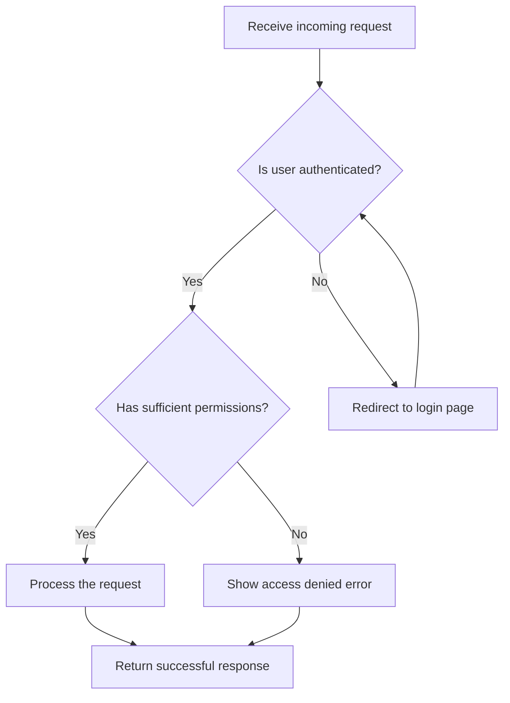

# Mermaid flowchart – multi-word node labels and branching syntax

Mermaid flowcharts support multi-word labels natively � spaces inside bracket delimiters require no escaping.

## Node delimiters

| Shape | Syntax | Use |
|---|---|---|
| Rectangle | `[Multi word label]` | Process / step |
| Diamond | `{Is user authenticated?}` | Decision / branch |
| Rounded | `(Label)` | Start / end |

## Edge labels (branch conditions)

Place the label between pipe characters after the arrow:

```
B -->|Yes| C
B -->|No| D
```

## Direction

`flowchart TD` � top-down (default). Alternatives: `LR` (left-right), `BT`, `RL`.

## Branching patterns

- Multiple outgoing edges from one node = branches (decisions).
- Multiple incoming edges to one node = converging paths � valid without special syntax.
- Back-edges (looping to a previous node) are valid; Mermaid renders them as curved arrows.

## Full example



Nodes: `A` entry, `B`/`C` decisions, `D`/`F` error branches, `E` happy path, `G` shared exit. `D --> B` is a retry back-edge.
