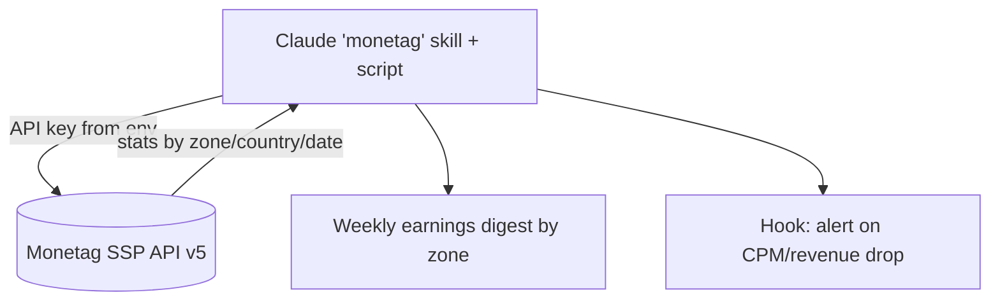

# Monetag SSP API and integration

**Monetag exposes both a no-code ad tag (paste-and-go) and a real publisher REST API (SSP API v5), organized around "zones" — and the API is what makes Monetag automatable by Claude the same way Accesstrade is.** You install ads via a tag/SDK, but you *manage and report* via the API.

## Core concept: Zones

A **zone** is a configured ad placement (a format on a property). Each zone has an **ID** and is the unit you create, embed, and pull stats for. SDK integrations start from a *main zone* that can link to *sub-zones* per format.

## Ways to integrate

| Option | Use |
|---|---|
| **MultiTag** | one JS `<script>` combining 5 formats, auto-optimized — the default for sites ([[Monetag ad formats]]) |
| **Smartlink / Direct Link** | a single URL for non-site traffic (404s, social, messengers) |
| **XML feed** | server-side / programmatic ad fetching |
| **WordPress plugin** | official plugin for WP sites |
| **SDK (npm or script tag)** | JS library that controls display logic & event tracking |
| **Telegram Mini App SDK** | `monetag-tg-sdk` (GitHub) + docs at `docs.monetag.com` — ads inside Telegram Mini Apps |

## The API (automation surface)

- **SSP API 5.0** — OpenAPI/Swagger UI at `api.monetag.com/v5/docs/`. Covers zone management and reporting.
- **Statistics**: filter earnings by **ad format, country, zone, OS, and date range** — the data a digest/dashboard needs.

## Claude automation angle

This mirrors [[Designing an Accesstrade skill for Claude Code]]: wrap the API in a skill whose script holds auth and pagination; add a [[Claude Code hooks event model|hook]] for scheduled digests/alerts. As always, keep the API key in an env var, never in a note — see [[Secrets handling for affiliate API keys]].

## Related

- [[Monetag ad formats]]
- [[Designing an Accesstrade skill for Claude Code]]
- [[Secrets handling for affiliate API keys]]
- [[Ad network vs affiliate network]]
- [[Monetag - MOC]]
