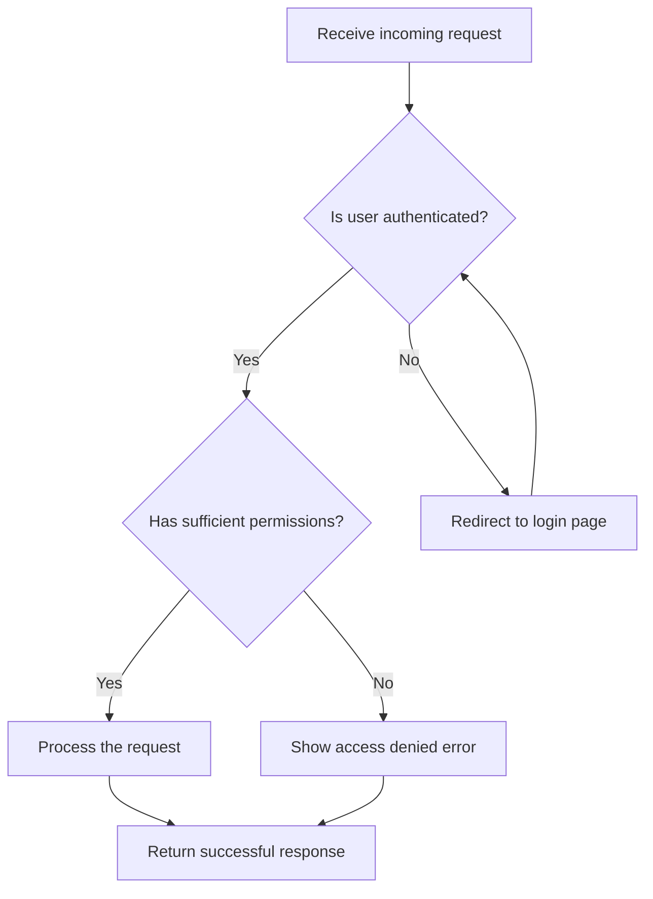

# Mermaid Flowchart - Multi-word Labels and Decision Branches

Mermaid flowchart node labels support multi-word text natively — spaces inside the bracket delimiters need no escaping or quoting. Branch logic is expressed purely by edge syntax, so a whole decision tree needs no extra directives.

## Syntax

| Element | Syntax | Use |
|---|---|---|
| Rectangle | `[Multi word label]` | Process / step |
| Diamond | `{Is user authenticated?}` | Decision / branch |
| Rounded | `(Label)` | Start / end |
| Labeled edge | `A -->\|Yes\| B` | Branch condition (label between pipes) |
| Direction | `flowchart TD` | Top-down (default); also `LR`, `BT`, `RL` |

## Branching rules

- Multiple outgoing edges from one node = branches.
- Multiple incoming edges to one node = converging paths; valid with no special syntax.
- Back-edges (reusing an earlier node ID, e.g. `D --> B`) are valid retries/loops; Mermaid renders them as curved arrows.

