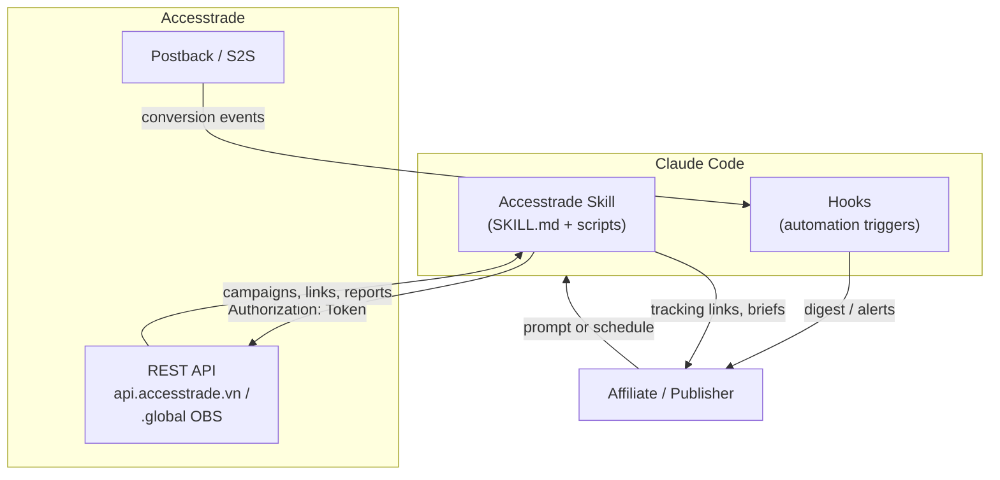

# Accesstrade API Integration - MOC

Map of content for using **Claude (Code)** to drive the **Accesstrade** affiliate network through its APIs — what the API offers, how to wrap it as Claude *skills* and *hooks*, and the best-practice automation use cases for affiliate work.

> [!info] Scope & honesty note
> Accesstrade ships **two different API generations** (see [[Accesstrade has two API generations]]). Endpoint paths, parameters, and limits below were synthesized from the public docs on `developers.accesstrade.vn` and `support.accesstrade.global` in June 2026. **Always re-confirm exact paths/limits against the live docs for your account/region before coding** — they drift, and some endpoints are region-gated.

## 1. The big picture

## 2. Accesstrade API (what it provides)

- [[Accesstrade affiliate network overview]] — what the platform is and the publisher model
- [[Accesstrade has two API generations]] — classic `.vn` Publisher API vs global OBS API
- [[Accesstrade Publisher API authentication]] — the `Token` header
- [[Accesstrade API rate limits and pagination]] — quotas, `since/until`, `page/limit`
- [[Accesstrade Campaigns API]] — discover & join campaigns
- [[Accesstrade tracking link creation]] — turn product URLs into affiliate links
- [[Accesstrade SubID attribution]] — `sub1-4` for granular tracking
- [[Accesstrade conversion and transaction reporting]] — money in, statuses
- [[Accesstrade Datafeeds API]] — bulk product catalog
- [[Accesstrade Promotions and Top Products APIs]] — coupons & best-sellers
- [[Accesstrade Creative APIs]] — banners, text, quick links (OBS)
- [[Accesstrade postback and S2S conversion tracking]] — event push vs API pull

## 3. Integrating with Claude (skills & hooks)

- [[Claude Code Skill anatomy]] — how a SKILL.md works
- [[Designing an Accesstrade skill for Claude Code]] — wrap the API as a reusable skill
- [[Claude Code hooks event model]] — the trigger system
- [[3 Resources/AI/Claude-Code/Hooks/Claude Code hooks event model]] — concrete hooks for affiliate work
- [[Secrets handling for affiliate API keys]] — never leak the token
- [[Skills vs Hooks vs MCP vs subagents]] — pick the right primitive

## 4. Best practices & use cases

- [[Use case - automated daily conversion digest]]
- [[Use case - bulk tracking link generation]]
- [[Use case - campaign discovery and datafeed content briefs]]
- [[Affiliate API engineering best practices]]
- [[Affiliate compliance and link hygiene]]

## 5. Visual boards

**Architecture (Excalidraw, rendered):**

![[claude-accesstrade-architecture.png]]

> Source: `assets/claude-accesstrade-architecture.excalidraw` (editable) · `.svg` / `.png` exports alongside.

**Canvas boards (open in Obsidian Canvas):**

- [[Affiliate automation blueprint.canvas|End-to-end automation blueprint]] — the discover→link→publish→convert→optimize loop, wired to every note.
- [[Accesstrade API map.canvas|Accesstrade API map]] — hub-and-spoke of the endpoint capabilities.

## Related

- [[Affiliate compliance and link hygiene]]
- [[Designing an Accesstrade skill for Claude Code]]
