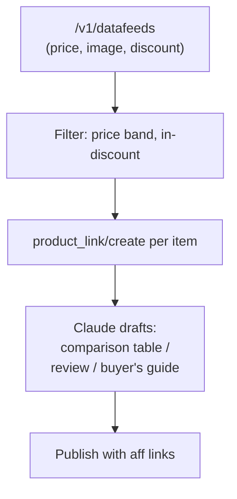

# Accesstrade Datafeeds API

**The Datafeeds endpoint returns the merchant's bulk product catalog — price, image, category, discount, and product URL — so you can build product-level content (reviews, comparison tables, "best of" lists) at scale instead of one link at a time.** It's the raw material for programmatic affiliate content.

## Endpoint (classic `.vn`)

`GET /v1/datafeeds` with filters:

| Param | Use |
|---|---|
| `campaign` | restrict to one merchant's catalog |
| `domain` | filter by merchant domain |
| `price_from` / `price_to` | price band |
| `discount_from` / `discount_to` | discount band |
| `status_discount` | only currently-discounted items |

Typical row fields: product name, price, discount/sale price, image URL, category, and the canonical product URL (which you then feed into [[Accesstrade tracking link creation]]).

## Why it pairs perfectly with Claude

A datafeed row is structured input Claude turns into output:

- Filter to a niche + price band, generate tracking links in bulk, and have Claude draft a comparison post grounded in *real* current prices and discounts.
- Re-pull periodically to refresh prices and flag items that went out of stock or off-discount.

> [!tip]
> Datafeeds can be large. Page through them and cache locally; filter server-side with the price/discount params before pulling everything.

## Related

- [[Accesstrade tracking link creation]]
- [[Accesstrade Promotions and Top Products APIs]]
- [[Use case - campaign discovery and datafeed content briefs]]
- [[Accesstrade API Integration - MOC]]

%% ai-graph-start %%

**Related notes:**
- [[Use case - campaign discovery and datafeed content briefs]]
- [[Accesstrade Promotions and Top Products APIs]]
- [[Accesstrade Campaigns API]]
- [[Accesstrade API Integration - MOC]]
- [[Use case - bulk tracking link generation]]

%% ai-graph-end %%