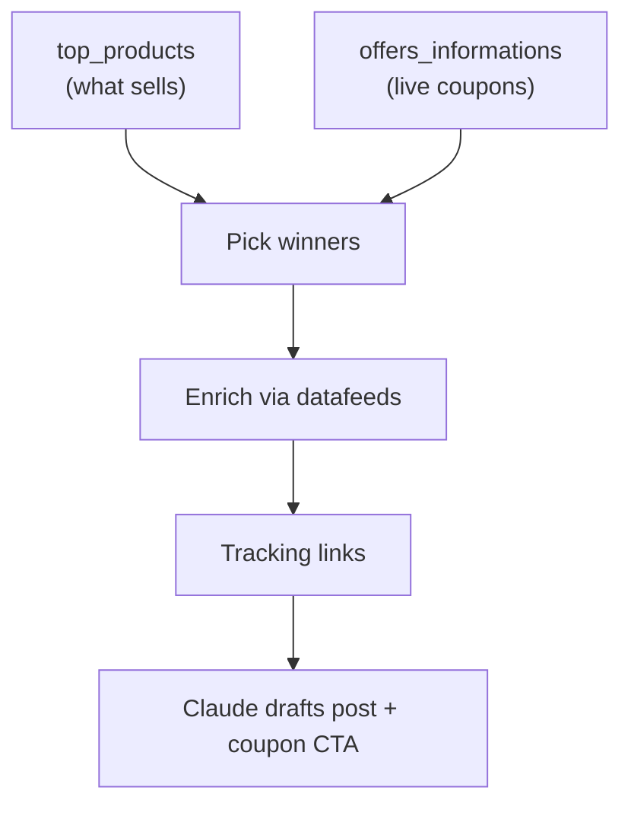

# Accesstrade Promotions and Top Products APIs

**These two read endpoints answer "what's hot and what's discounted right now?" — they surface the offers most likely to convert, so you can prioritize content around proven sellers and live coupons instead of guessing.**

## Promotions / Offers — `GET /v1/offers_informations`

Returns active promotions and coupon codes. Filters: `scope`, `merchant`, `categories`, `coupon`, `status`, `limit`.

Use it to:
- Pull current **coupon codes** to embed alongside affiliate links (coupons lift conversion materially).
- Detect time-limited sales worth a quick post (flash sales, mega-sale days like 11.11 / 12.12, big in SEA).

## Top Products — `GET /v1/top_products`

Returns best-selling products over a window. Params: `date_from`, `date_to`, `merchant`.

Use it to:
- Rank what's actually selling, then build content around it (social proof + already-validated demand).
- Seed a "Top 10 this month" post that you refresh on a schedule.

## How they fit the content engine

> [!tip] Pairing
> `top_products` tells you *what* to write about; `offers_informations` gives you the *coupon hook*; [[Accesstrade Datafeeds API|datafeeds]] supplies price/image detail; [[Accesstrade tracking link creation|product_link]] makes it earn. That's a full content pipeline from four read calls + one write call.

## Related

- [[Accesstrade Datafeeds API]]
- [[Accesstrade tracking link creation]]
- [[Use case - campaign discovery and datafeed content briefs]]
- [[Accesstrade API Integration - MOC]]

%% ai-graph-start %%

**Related notes:**
- [[Accesstrade Datafeeds API]]
- [[Use case - campaign discovery and datafeed content briefs]]
- [[Accesstrade Campaigns API]]
- [[Accesstrade API Integration - MOC]]
- [[Affiliate content-brief generator produces the grounded skeleton, not the prose]]

%% ai-graph-end %%