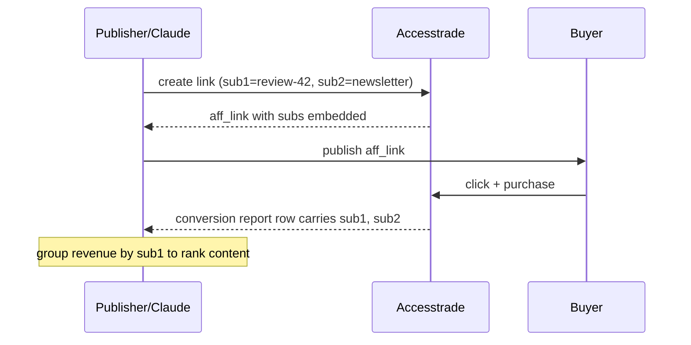

# Accesstrade SubID attribution

**SubIDs (`sub1`–`sub4`, called `subIds` on OBS) are free-form tags you stamp onto a tracking link so that when a conversion comes back, you can tell *which* of your placements earned it.** Accesstrade stores them on the click and echoes them on the conversion record, giving you placement-level attribution without any extra tracking infrastructure.

## How the round-trip works

## Why it's the backbone of affiliate analytics

- **Granularity for free:** encode content slug, channel, campaign, and audience in the 4 slots (e.g. `sub1=post-slug`, `sub2=channel`, `sub3=ab-variant`, `sub4=date`).
- **Closed loop:** the [[Accesstrade conversion and transaction reporting|conversion report]] returns the same subs, so a Claude job can `GROUP BY sub1` to compute revenue-per-post and EPC.
- **Tool interop:** trackers (e.g. wecantrack) auto-inject SubIDs to match traffic to conversions and forward them to GA/Ads/Meta.

## Conventions that save pain

- Keep a **documented schema** for what each sub slot means and never repurpose a slot mid-quarter — historical reports become unreadable otherwise.
- Use URL-safe, low-cardinality-where-possible values; avoid spaces.
- A stable `sub1 = content identifier` is the single highest-value convention — it's what lets you answer "which article makes money?".

## Related

- [[Accesstrade tracking link creation]]
- [[Accesstrade conversion and transaction reporting]]
- [[Accesstrade postback and S2S conversion tracking]]
- [[Accesstrade API Integration - MOC]]

%% ai-graph-start %%

**Related notes:**
- [[Accesstrade tracking link creation]]
- [[Use case - bulk tracking link generation]]
- [[Accesstrade postback and S2S conversion tracking]]
- [[Accesstrade API Integration - MOC]]
- [[Accesstrade affiliate network overview]]

%% ai-graph-end %%