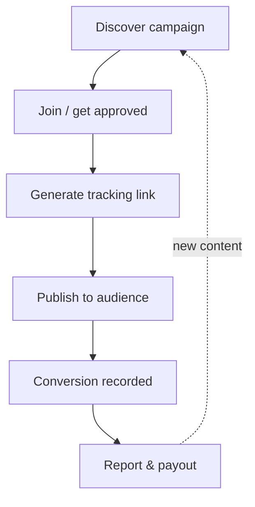

# Accesstrade affiliate network overview

**Accesstrade is a performance-marketing (affiliate) network, operated by the Japanese firm Interspace, that is dominant across Southeast Asia** — Vietnam (`accesstrade.com.vn` / `pub.accesstrade.vn`), Thailand, Indonesia, the Philippines, Malaysia, Singapore, and Japan. It connects **advertisers** (merchants running *campaigns*) with **publishers** (affiliates who drive traffic) and pays publishers a commission on tracked conversions.

## Why it matters for automation

Three roles define everything the API does:

- **Advertiser / Merchant** — runs a *campaign* with reward rules (CPS %, CPA, CPI, CPL).
- **Publisher** — you; you join campaigns, generate tracking links, and earn commission.
- **Conversion** — a tracked action (sale, lead, app install) attributed to your link.

The publisher workflow is a tight loop the API exposes end to end: **discover campaigns → join → generate tracking links → distribute → conversions are recorded → report & get paid**. That loop is exactly what makes Accesstrade a good fit for Claude-driven automation.

## Key facts

- Reward models: **CPS** (commission per sale, a % of order value), **CPA/CPL** (per action/lead), **CPI** (per install — common for app campaigns).
- Conversions carry a **status lifecycle** (pending → approved/rejected) because merchants validate orders before paying.
- A publisher operates one or more **sites** (traffic sources); the newer API keys most calls to a `siteId`.

## Related

- [[Accesstrade has two API generations]]
- [[Accesstrade Campaigns API]]
- [[Accesstrade conversion and transaction reporting]]
- [[Accesstrade API Integration - MOC]]

%% ai-graph-start %%

**Related notes:**
- [[Accesstrade API Integration - MOC]]
- [[Accesstrade Campaigns API]]
- [[Ad network vs affiliate network]]
- [[Accesstrade Datafeeds API]]
- [[Accesstrade conversion and transaction reporting]]

%% ai-graph-end %%