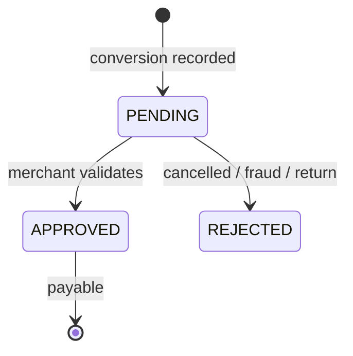

# Accesstrade conversion and transaction reporting

**The reporting endpoints are how money flows back into your system: they return each tracked conversion, its commission, and its approval status.** This is the read side of the loop and the data source for every earnings dashboard or digest.

## Classic `.vn`

| Endpoint | Purpose | Key params |
|---|---|---|
| `GET /v1/transactions` | recorded commission transactions | `since`, `until` *(required)*, `page`, `limit`, `status`, `merchant`, `transaction_id` |
| `GET /v1/order-list` | orders v2 | `since`, `until` *(required)*, `page`, `limit`, `status`, `merchant` |
| order product info / order detail | line items within an order | order id |

## Global OBS

| Endpoint | Purpose |
|---|---|
| `GET /v1/publishers/me/reports/conversion` | aggregate: `totalConversionsCount`, `totalReward`, per-row `status`, `reward`, `transactionAmount`, `deviceType`, `browser`, `country` |
| `GET /v1/publishers/me/reports/conversion/detail` | paginated detail: `verificationId`, `clickTime`, `conversionTime`, `reward`, `hasProduct` |

Filters: `fromDate`/`toDate` (required ISO), optional `siteId`, `campaignId`, `periodBase`, `conversionStatuses`.

> [!warning] Cadence
> The OBS conversion report is **1 request / 5 minutes**, 7-day window max — see [[Accesstrade API rate limits and pagination]].

## The status lifecycle (don't count money too early)

- **PENDING** = recorded but not yet payable; merchants validate (returns, fraud) before approving.
- Report **approved** revenue separately from **pending** — treating pending as earned overstates income.
- Use `periodBase = UPDATED_DATE` to catch rows whose status flipped since your last sync.

## Related

- [[Accesstrade SubID attribution]]
- [[Accesstrade API rate limits and pagination]]
- [[Accesstrade postback and S2S conversion tracking]]
- [[Use case - automated daily conversion digest]]
- [[Accesstrade API Integration - MOC]]

%% ai-graph-start %%

**Related notes:**
- [[Accesstrade API rate limits and pagination]]
- [[Accesstrade Campaigns API]]
- [[Accesstrade postback and S2S conversion tracking]]
- [[Accesstrade has two API generations]]
- [[Accesstrade affiliate network overview]]

%% ai-graph-end %%