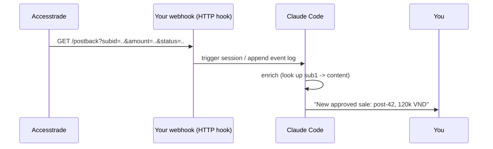

# Accesstrade postback and S2S conversion tracking

**There are two ways to get conversion data out of Accesstrade — pull it from the report API, or have Accesstrade push each event to your URL (postback / server-to-server). They are complementary, not redundant.** Knowing which to use shapes whether your Claude automation is *scheduled* or *event-driven*.

## Pull vs Push

| | API pull (report) | Postback / S2S push |
|---|---|---|
| Direction | you poll Accesstrade | Accesstrade calls your URL |
| Latency | you schedule it | near real-time, per conversion |
| Data richness | **rich** — see [[Accesstrade conversion and transaction reporting]] | **lean**: only the fields you templated into the URL |
| Best for | dashboards, digests, reconciliation | instant alerts, feeding other systems |
| Claude primitive | a **scheduled skill** / cron | a **hook / webhook endpoint** |

## How postback flows into a hook

The postback URL is configured in the Accesstrade dashboard with placeholders (order id, amount, SubID, status). Point it at an endpoint that an [[Claude Code hooks event model|HTTP hook]] or a small webhook server consumes.

## Decision rule

- Need **reconciled, status-aware earnings** → **API pull** on a schedule ([[Use case - automated daily conversion digest]]).
- Need a **ping the instant a sale lands** → **postback** into a webhook/hook.
- Most serious setups run **both**: postback for immediacy, API for the source of truth — a postback fires once at conversion time and never tells you about a later PENDING→APPROVED flip.

## Related

- [[Accesstrade conversion and transaction reporting]]
- [[Accesstrade SubID attribution]]
- [[Affiliate automation hook patterns]]
- [[Accesstrade API Integration - MOC]]
