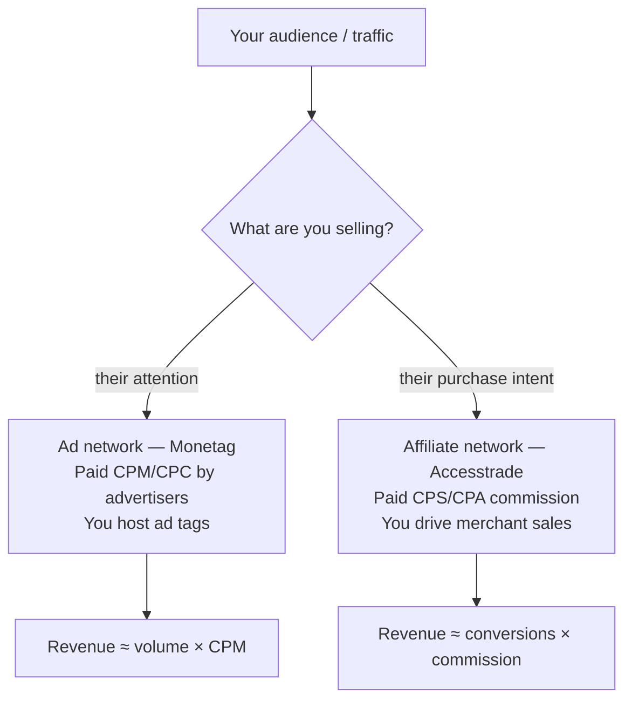

# Ad network vs affiliate network

**An ad network (e.g. Monetag) pays a publisher for their audience's *attention* — CPM/CPC on impressions — while an affiliate network (e.g. Accesstrade) pays for *intent realized* — CPS/CPA commission on actual sales. The same person is the "publisher" in both, but the revenue model, traffic fit, and content strategy differ sharply.** Knowing which model a platform is prevents category errors (e.g. expecting "tracking links to merchants" from Monetag, which has none).

## Side by side

| | Ad network (Monetag) | Affiliate network (Accesstrade) |
|---|---|---|
| You get paid for | impressions / clicks (CPM/CPC) | confirmed sales/actions (CPS/CPA) |
| What you place | ad tags / formats | tracking links to merchant products |
| Traffic fit | high-volume, low-intent OK | high-intent, buyer-ready |
| Revenue driver | sheer traffic + CPM | conversion rate × commission |
| Payment certainty | per impression (steadier) | per validated conversion (lumpier, can be rejected) |
| Latency to cash | weekly | pending → approved over days/weeks |

## They're complementary, not rival

Many publishers run **both**: affiliate links inside high-intent content (reviews, comparisons) and an ad network on everything else (and on traffic the affiliate offer can't use). The two fill different slots of the same audience.

> [!tip] Automation parity
> Both expose publisher APIs, so the Claude pattern is identical — a [[Designing an Accesstrade skill for Claude Code|skill wrapping the API]] + [[3 Resources/AI/Claude-Code/Hooks/Claude Code hooks event model|hooks for digests/guards]]. Only the *metrics* differ (CPM/zone vs commission/sub1).

## Related

- [[Monetag overview]]
- [[Monetag SSP API and integration]]
- [[Accesstrade affiliate network overview]]
- [[Accesstrade API Integration - MOC]]
- [[Monetag - MOC]]

%% ai-graph-start %%

**Related notes:**
- [[Monetag - MOC]]
- [[Monetag overview]]
- [[Accesstrade affiliate network overview]]
- [[Monetag SSP API and integration]]
- [[Monetag referral program]]

%% ai-graph-end %%