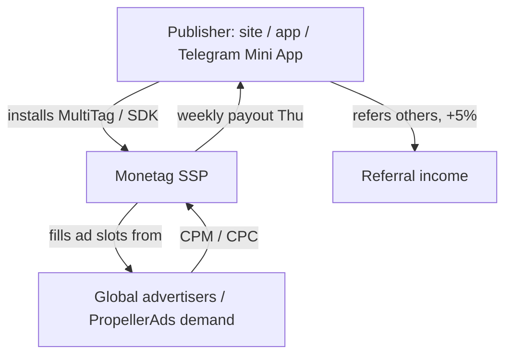

# Monetag - MOC

Index for the **Monetag** research cluster (`promo.monetag.com/vn`). What Monetag *is* → [[Monetag overview]].

> [!info] Source & freshness
> Figures (CPM, payout thresholds, publisher counts) come from the Vietnam landing page and third-party reviews captured **June 2026**, plus the official API/help docs. Verify current terms on `monetag.com` before relying on numbers.

## Notes

- [[Monetag overview]] — what it is, model, PropellerAds lineage, scale
- [[Monetag ad formats]] — popunder, push, in-page push, interstitial, vignette, smartlink, MultiTag
- [[Monetag payments and payout terms]] — methods, thresholds, weekly schedule
- [[Monetag referral program]] — 5% lifetime referral
- [[Monetag SSP API and integration]] — MultiTag tag, Zones, Statistics, API v5, Telegram SDK
- [[Ad network vs affiliate network]] — Monetag (CPM) vs Accesstrade (CPS): the key distinction

## Bridge to the Accesstrade work

- [[Accesstrade API Integration - MOC]] — the affiliate-network side; same Claude-automation patterns ([[Designing an Accesstrade skill for Claude Code|skill]] + [[Claude Code hooks event model|hooks]]) apply to Monetag's reporting API.

## Related

- [[Ad network vs affiliate network]]
- [[Monetag SSP API and integration]]

%% ai-graph-start %%

**Related notes:**
- [[Monetag overview]]
- [[Monetag SSP API and integration]]
- [[Ad network vs affiliate network]]
- [[Monetag ad formats]]
- [[Monetag referral program]]

%% ai-graph-end %%