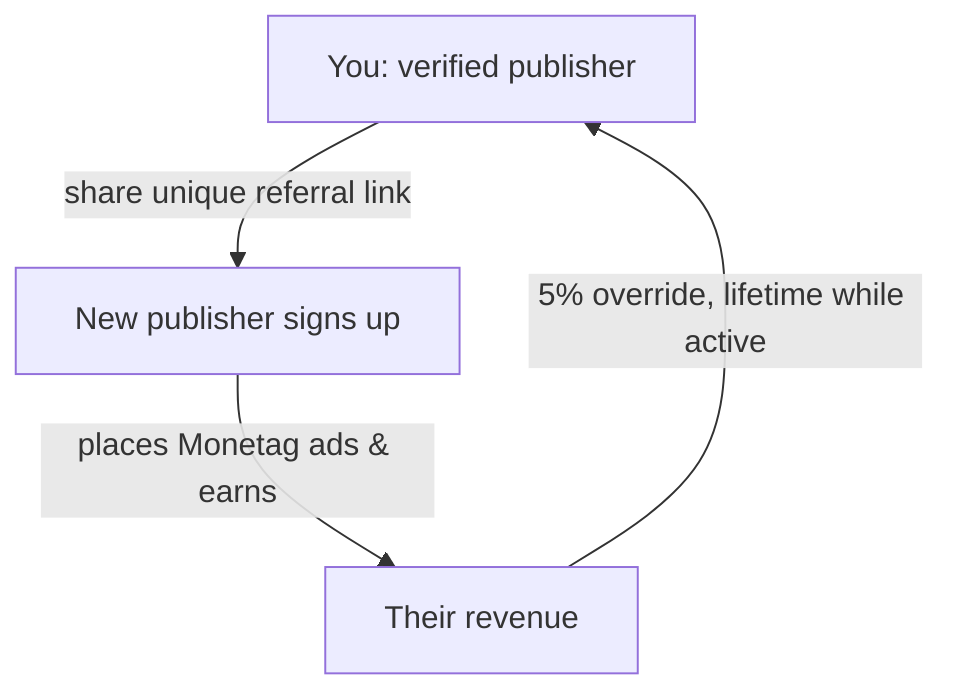

# Monetag referral program

**Monetag pays a verified publisher 5% of the revenue of any publisher they refer, for as long as that referred publisher stays active — a lifetime override, not a one-off bounty.** It is Monetag's *own* growth incentive, distinct from Monetag being an affiliate network (it isn't — see [[Ad network vs affiliate network]]).

## How it works

- You must be a **verified publisher** (site verified) to get a referral link — it's not open to non-registered users.
- The 5% comes out of **Monetag's** margin, not the referred publisher's earnings, so there's no downside to the person you refer.
- Earnings start only once the referred publisher actually runs ads and generates revenue.

## Angle for content creators

If you publish tutorials/reviews about web monetization, the referral link is a natural [[Ad network vs affiliate network|monetization]] layer on that content — and it compounds passively as referees keep earning.

## Related

- [[Monetag overview]]
- [[Monetag payments and payout terms]]
- [[Ad network vs affiliate network]]
- [[Monetag - MOC]]

%% ai-graph-start %%

**Related notes:**
- [[Monetag - MOC]]
- [[Monetag overview]]
- [[Monetag payments and payout terms]]
- [[Ad network vs affiliate network]]
- [[Monetag ad formats]]

%% ai-graph-end %%