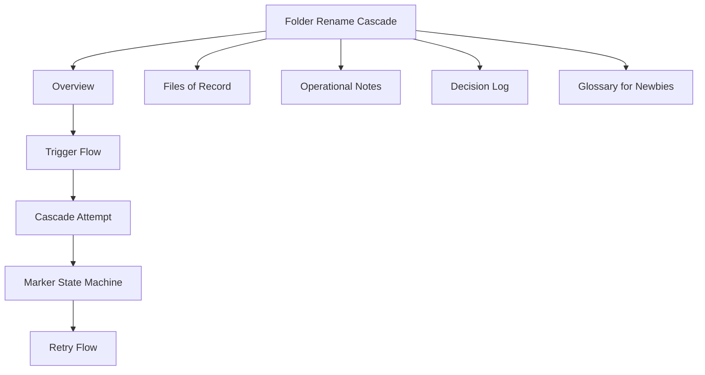

# Folder Rename Cascade

> Ticket: **LUZ-154157** - eArchive backend P1.4.3 cascade changes
> Branch: `kepler/sprint-157/LUZ-154157-...`
> Status: rolled out to dev (latest tag `3661b7c`)

## Start here

This note explains what happens when a folder is renamed and the system must update every document that stores that folder name.

If you are new to the topic, read in this order:

1. [[technical-points/01 Overview - Folder Rename Cascade|Overview]]
2. [[technical-points/02 Trigger Flow|Trigger flow]]
3. [[technical-points/03 Cascade Attempt|Cascade attempt]]
4. [[technical-points/04 Marker State Machine|Marker state machine]]
5. [[technical-points/05 Retry Flow|Retry flow]]
6. [[technical-points/06 Files of Record|Files of record]]
7. [[technical-points/07 Operational Notes|Operational notes]]
8. [[technical-points/08 Decision Log|Decision log]]
9. [[technical-points/09 Glossary for Newbies|Glossary for newbies]]

## TL;DR

When a folder is renamed through `PUT /folders/{id}` or `PATCH /folders/{id}`, every document that references that folder must update the matching entry in its materialized `_folderNames` array.

The update runs on the server in one MongoDB aggregation-pipeline `updateMany`, without paging through documents one page at a time. If MongoDB reports that some matched documents were not modified, the system keeps a row in the tenant's `materializeCascade` collection so a later request can retry the unfinished work.

## Obsidian map



## Key idea in plain English

Think of a document as storing two matching lists:

```text
folderIds:     [123, 456]
_folderNames:  [Inbox, Contracts]
```

If folder `456` is renamed from `Contracts` to `Legal`, the system only changes the second name:

```text
folderIds:     [123, 456]
_folderNames:  [Inbox, Legal]
```

The folder ID stays stable. Only the stored display name changes.
